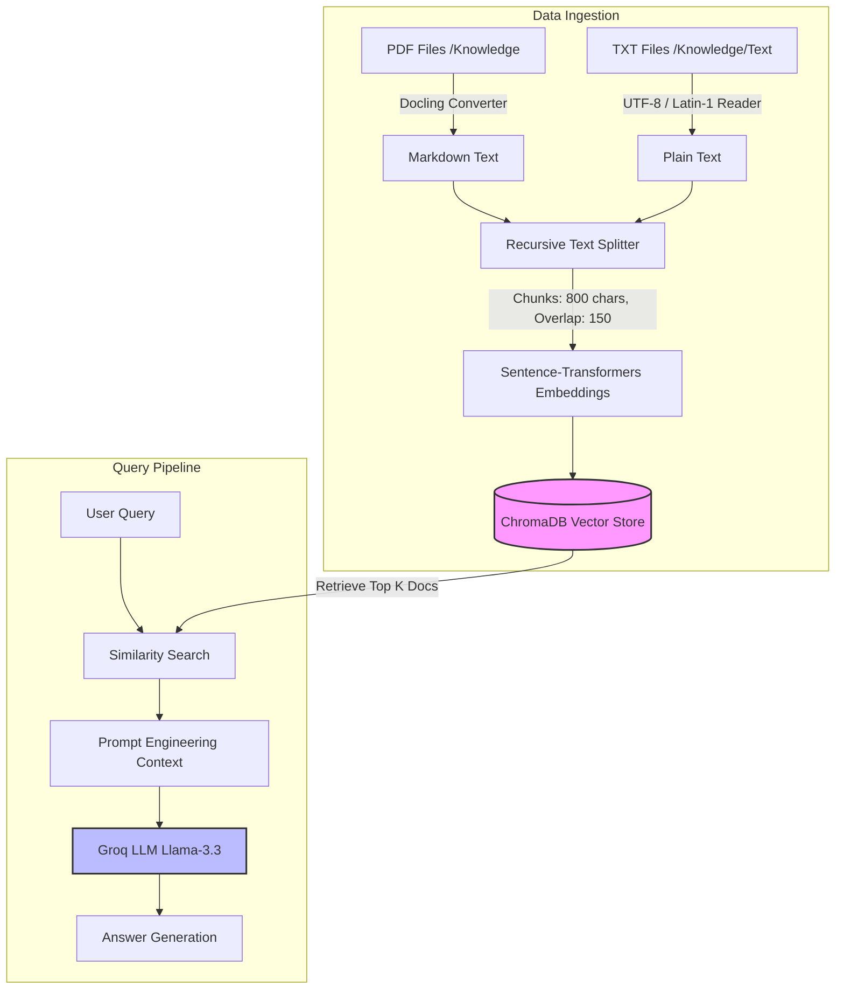

# 📚 RAG Question Answering System

A professional, production-ready Retrieval-Augmented Generation (RAG) system powered by **Docling**, **ChromaDB**, **LangChain**, and **Groq LLMs** (`llama-3.3-70b-versatile`). This system allows you to ingest documents (PDFs and Text files), index them into a high-performance local vector database, and perform context-constrained Q&A through both a CLI and a beautiful Streamlit Web interface.

---

## ⚡ Features

- **Advanced Document Ingestion**: Employs **Docling** for high-fidelity PDF parsing and markdown conversion.
- **Robust Text Ingestion**: Specifically targets and parses txt files, handling encoding issues gracefully.
- **High-Performance Vector Store**: Local vector storage using **ChromaDB** with auto-persistence.
- **State-of-the-Art LLM**: Powered by **Groq API** (`llama-3.3-70b-versatile`) with context constraints to prevent hallucinations.
- **Flexible Interfaces**:
  - **CLI (Terminal)**: Interactive command-line interface for fast querying.
  - **Streamlit Web UI**: Elegant, responsive web dashboard showing active collection stats and interactive chat.
- **Database Utilities**: Easily clean up or delete specific TXT vectors from your database without rebuilding the entire index.

---

## 🏗️ Architecture Flow



---

## 🛠️ Tech Stack

- **Framework**: LangChain (`langchain`, `langchain-community`, `langchain-chroma`, `langchain-huggingface`, `langchain-groq`)
- **PDF Parser**: Docling
- **Vector Database**: ChromaDB
- **Embedding Model**: `sentence-transformers/all-MiniLM-L6-v2`
- **Inference Provider**: Groq Cloud (`llama-3.3-70b-versatile`)
- **Web App**: Streamlit

---

## 🚀 Getting Started

### Prerequisites

Ensure you have **Python 3.10+** installed on your system.

### 1. Clone & Navigate to Project

```bash
git clone <repository-url>
cd RAG-Docling
```

### 2. Set Up Virtual Environment

Create and activate a virtual environment:

```bash
# Windows
python -m venv venv
venv\Scripts\activate

# macOS / Linux
python3 -m venv venv
source venv/bin/activate
```

### 3. Install Dependencies

```bash
pip install -r requirements.txt
```

### 4. Environment Configuration

Create a `.env` file in the root directory:

```env
GROQ_API_KEY=your_groq_api_key_here
```

> [!NOTE]
> Get your Groq API Key from the [Groq Console](https://console.groq.com/).

---

## 📂 Project Structure

```
├── Knowledge/             # Main directory for all knowledge base documents
│   └── Text/              # Subdirectory for TXT documents (e.g. update.txt)
├── chroma_db/             # Local ChromaDB vector database directory (Auto-generated)
├── app1.py                # Streamlit Web Application
├── ingest.py              # Ingestion pipeline for PDFs (using Docling)
├── ingestfortxt.py        # Ingestion pipeline for TXT files
├── query.py               # Interactive CLI pipeline
├── deletetxtvector.py     # Utility to delete TXT-sourced vectors
├── requirements.txt       # Project dependencies
└── README.md              # Project documentation
```

---

## 📖 Usage Guide

### Step 1: Ingest Documents

Place your PDF books/documents inside the `Knowledge/` folder, or your text update files (like `update.txt`) inside the `Knowledge/Text/` folder.

To ingest PDF documents:
```bash
python ingest.py
```

To ingest TXT documents:
```bash
python ingestfortxt.py
```

### Step 2: Query the RAG System

You can run the RAG system in one of two modes:

#### 1. Interactive Command Line (CLI)

```bash
python query.py
```
**Example Session:**
```text
✅ RAG system ready. Type 'exit' to quit.

🧠 Ask your question: What is the main thesis of Chapter 2?
📌 Answer: [Accurate answer compiled strictly from your documents]
```

#### 2. Streamlit Web Dashboard

```bash
streamlit run app1.py
```
This opens a browser page (typically at `http://localhost:8501`) showing a premium workspace where you can input questions, view the total collection count in the sidebar, and get real-time responses.

### Maintenance: Deleting TXT Vectors

If you want to clear out vectors specifically ingested from TXT files (e.g., to replace them with fresh runs without rebuilding your PDF index):
```bash
python deletetxtvector.py
```

---

## 🔒 Safety & Constrained Q&A

The system is configured with a strict context constraint prompt. If the answer to your query cannot be found within the retrieved chunks from ChromaDB, the assistant will output:
> *"I don't know based on the provided documents."* (CLI) or *"I don't know"* (Web UI).

This prevents the LLM from hallucinating answers based on pre-trained knowledge.
